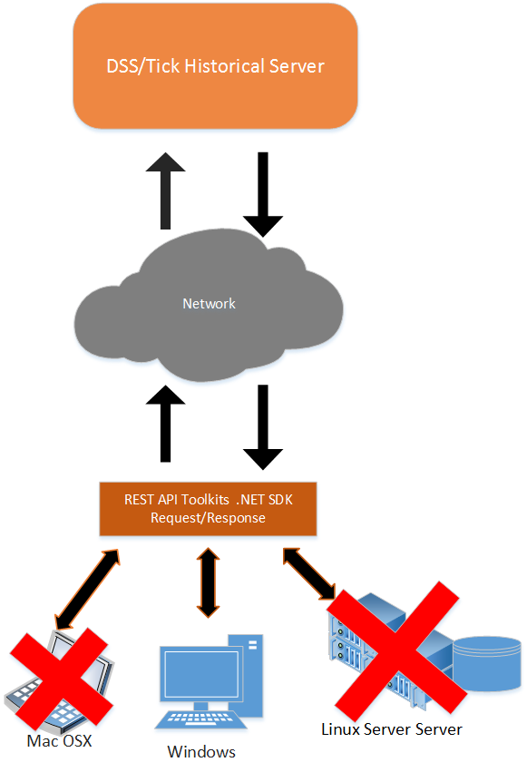
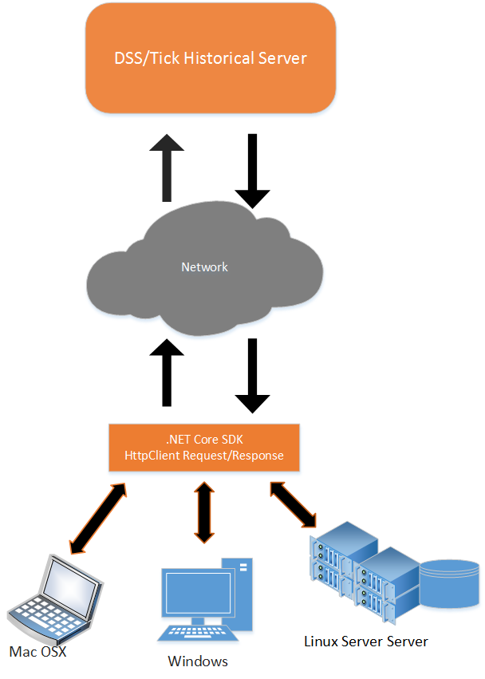

# Using Microsoft .NET Core with Tick History REST API

## About the example

This example is C# console based application and it was created to demonstrates how to use Microsoft .NET Core SDK version 2.0 with TRTH (Thomson Reuters Tick History) REST API. The example also use the REST API with direct HTTPs . It can use to retrieve Historical Tick data (Time and Sales data) and End of day data, with an On Demand extraction request. 

## About the REST API

Tick History's REST API is a Representational State Transfer (REST)-compliant API that programmatically exposes Tick History functionality on the DataScope Select platform. Client applications can be written in most programming languages, such as C#, C++, Visual Basic, Java, Python and Swift. 

There are two options for .NET developer to use the REST API. The first option is to use [REST API toolkit](https://developers.thomsonreuters.com/thomson-reuters-tick-history-trth/thomson-reuters-tick-history-trth-rest-api/learning?content=8713&type=learning_material_item) and the second one is to communicating directly with the server using HTTPS. At the time we are writing this article, using the REST API toolkit has some limitation when user want to deploy .NET application on other platforms such as macOS, Linux and AWS Lambda Cloud environment. This is because the toolkit was created with .NET Framework 4.x which support Windows platform only. Cloud environment such as AWS Lambda supports only function code in C# using the .NET Core SDK 2.x. As a result they are unable to run .NET application which built with the REST API toolkit on other platforms. More information about a limitation of the Toolkit will be provided in next topic. There are an option for .NET developer to develop an application on cross platform environment, they can develop the application with .NET Core SDK. Developers can use .NET Core functionality to communicate directly over HTTPS and it just like working with other programming languages such as Java or Python.


### Limitation of REST API Toolkit

This section describing the issue when using the REST API Toolkit on macOS or Linux. At the time we write this article, we understand that the Toolkit has the following limitation.

* It supports only Windows Platform because the Toolkit still building with .NET Framework 4.x. 

* It's unable to run on macOS and Linux as it requires some of dependency libraries that available on Windows only.

* It’s not an Open Source SDK therefore we are unable to modify the codes or change anything in oder to upgrade the dependency libraries used by the Toolkit.



Typically you can create a new project target .NET Core 2.x on Visual Studio 2017 and then add libraries from the REST API Toolkit to the project. You should be able to build the solution or project without any error and you should be able to run it on Windows platform. The following sample codes demonstrates Extraction request and it works very well on Windows with .NET Core 2.0 Project type.

```cs
var ExtractionsContext = new ExtractionsContext(new Uri("https://hosted.datascopeapi.reuters.com/RestApi/v1/"), "<UserName>", "Password");
var availableFields = ExtractionsContext.GetValidContentFieldTypes(ReportTemplateTypes.TickHistoryTimeAndSales);

//Find fields that are trade or quote related
var fields = availableFields
            .Where(x => x.FieldGroup == "Quote" || x.FieldGroup == "Trade")
            .Select(x => x.Name).ToArray();

//Request an extraction
//Reduce the poll time for the purposes of the example (to trigger async processing and exhibit a polling step).
ExtractionsContext.Preferences.WaitSeconds = 5;
ExtractionsContext.Options.AutomaticDecompression = true; //Decompress gzip to plain text
var startDate = new DateTimeOffset(2016, 9, 29, 0, 0, 0, TimeSpan.FromHours(-5)); //Central Time Zone
var endDate = startDate.AddHours(12);
var result = ExtractionsContext.ExtractRaw(
            new TickHistoryTimeAndSalesExtractionRequest
            {
                Condition = new TickHistoryTimeAndSalesCondition
                {
                        ReportDateRangeType = ReportDateRangeType.Range,
                        QueryStartDate = startDate,
                        QueryEndDate = endDate,
                        ApplyCorrectionsAndCancellations = false,
                        ExtractBy = TickHistoryExtractByMode.Ric,
                        MessageTimeStampIn = TickHistoryTimeOptions.GmtUtc,
                        SortBy = TickHistorySort.SingleByRic,
                        DisplaySourceRIC = false
                },
                ContentFieldNames = fields,
                IdentifierList = new InstrumentIdentifierList
                {
                    InstrumentIdentifiers = new[]
                    {
                        InstrumentIdentifier.Create(IdentifierType.Ric, "IBM.N"),
                    }
                },
            });

            //Download the results
            using (var response = ExtractionsContext.RawExtractionResultOperations.GetReadStream(result))
            using (var stream = response.Stream)
            using (var reader = new StreamReader(stream))
            {
                var lineCount = 0;
                while (!reader.EndOfStream && lineCount++ < 10) //Limit to ten rows for the example
                    Console.WriteLine(reader.ReadLine());
            }
```

However if you copy the same .NET Core project to macOS or Linux and rebuild it. You may receive errors about unresolved reference like following errors.

```command
user1@ubuntudev1:~/workspaces/ConsoleApp8/ConsoleApp8$ dotnet build
Microsoft (R) Build Engine version 15.5.179.9764 for .NET Core
Copyright (C) Microsoft Corporation. All rights reserved.

Restore completed in 33.87 ms for /home/mcca/workspaces/ConsoleApp8/ConsoleApp8/ConsoleApp8.csproj.
/usr/share/dotnet/sdk/2.1.3/Microsoft.Common.CurrentVersion.targets(2041,5): warning MSB3245: Could not resolve this reference. Could not locate the assembly "Microsoft.OData.Client". Check to make sure the assembly exists on disk. If this reference is required by your code, you may get compilation errors. [/home/mcca/workspaces/ConsoleApp8/ConsoleApp8/ConsoleApp8.csproj]
/usr/share/dotnet/sdk/2.1.3/Microsoft.Common.CurrentVersion.targets(2041,5): warning MSB3245: Could not resolve this reference. Could not locate the assembly "Microsoft.OData.Core". Check to make sure the assembly exists on disk. If this reference is required by your code, you may get compilation errors. [/home/mcca/workspaces/ConsoleApp8/ConsoleApp8/ConsoleApp8.csproj]
/usr/share/dotnet/sdk/2.1.3/Microsoft.Common.CurrentVersion.targets(2041,5): warning MSB3245: Could not resolve this reference. Could not locate the assembly "Microsoft.OData.Edm". Check to make sure the assembly exists on disk. If this reference is required by your code, you may get compilation errors. [/home/mcca/workspaces/ConsoleApp8/ConsoleApp8/ConsoleApp8.csproj]
/usr/share/dotnet/sdk/2.1.3/Microsoft.Common.CurrentVersion.targets(2041,5): warning MSB3245: Could not resolve this reference. Could not locate the assembly "Microsoft.Spatial". Check to make sure the assembly exists on disk. If this reference is required by your code, you may get compilation errors. [/home/mcca/workspaces/ConsoleApp8/ConsoleApp8/ConsoleApp8.csproj]
/usr/share/dotnet/sdk/2.1.3/Microsoft.Common.CurrentVersion.targets(2041,5): warning MSB3245: Could not resolve this reference. Could not locate the assembly "Newtonsoft.Json". Check to make sure the assembly exists on disk. If this reference is required by your code, you may get compilation errors. [/home/mcca/workspaces/ConsoleApp8/ConsoleApp8/ConsoleApp8.csproj]
/usr/share/dotnet/sdk/2.1.3/Microsoft.Common.CurrentVersion.targets(2041,5): warning MSB3245: Could not resolve this reference. Could not locate the assembly "ThomsonReuters.Dss.Core.RestApi.Common". Check to make sure the assembly exists on disk. If this reference is required by your code, you may get compilation errors. [/home/mcca/workspaces/ConsoleApp8/ConsoleApp8/ConsoleApp8.csproj]
/usr/share/dotnet/sdk/2.1.3/Microsoft.Common.CurrentVersion.targets(2041,5): warning MSB3245: Could not resolve this reference. Could not locate the assembly "ThomsonReuters.Dss.RestApi.Client". Check to make sure the assembly exists on disk. If this reference is required by your code, you may get compilation errors. [/home/mcca/workspaces/ConsoleApp8/ConsoleApp8/ConsoleApp8.csproj]
Program.cs(2,7): error CS0246: The type or namespace name 'ThomsonReuters' could not be found (are you missing a using directive or an assembly reference?) [/home/mcca/workspaces/ConsoleApp8/ConsoleApp8/ConsoleApp8.csproj]
Program.cs(3,7): error CS0246: The type or namespace name 'ThomsonReuters' could not be found (are you missing a using directive or an assembly reference?) [/home/mcca/workspaces/ConsoleApp8/ConsoleApp8/ConsoleApp8.csproj]

Build FAILED.
```
At the time we write this article, it looks like the version of OData Client with related components used by the REST API toolkit is not compatible with OData Client supported by .NET Core 2.x. And it seems be the main problem prevents us from using the API Toolkit on macOS or Linux. The reason that it works on Windows because you have .NET Framework installed on the Windows therefore the application can load underlying libraries provided by .NET Framework 4.x. If you copy the same project to a new installed Windows and it has only .NET Core 2.0 installed, you should see the same error message generated by **dotnet** command.

## .NET Core Solution

As explained earlier .NET developer may choose alternative approach by communicate directly over HTTPS like the other programming languages. So they can control everything including the way to send Http request and process the Http response. However developer has to understand what are the request messages they need to send and what are the Http Headers required by the server. There are [REST API User Guide](https://developers.thomsonreuters.com/thomson-reuters-tick-history-trth/thomson-reuters-tick-history-trth-rest-api/docs?content=11928&type=documentation_item) and the [REST API Reference](https://hosted.datascopeapi.reuters.com/RestApi.Help/Home/ExampleAppDownload?Id=1) that provide more information about the API specification and the information about HTTP request and response along with the request condition and its parameters.



.NET Core 2.x SDK providing HTTPClient class which can used to send Http request and process the response message and it has a new version of [NewtonSoft JSON.NET](https://www.newtonsoft.com/json) which support .NET Core target platform and fully compatible with .NET Core 2.x. Developer can use both library or class together to process the message and get the Json data.

### Technical Requirements

Based on the solution described above, this example requires the following SDK and library for implementing .NET Core application.

* Visual Studio 2017 or Visual Studio Code.
* .NET Core 2.0 SDK. You can find installation instruction including the document about .NET Core from [Microsoft website](https://www.microsoft.com/net/core/platform). This example use [HttpClient](https://docs.microsoft.com/en-us/dotnet/csharp/tutorials/console-webapiclient) class to send request and get response from DSS Server.

* C# is the programming language used in example application. 

* Using [NewtonSoft Json.Net](https://www.newtonsoft.com/json) to parse data from the Http response message.

You can use Visual Studio 2017 or using just Visual Studio code to open the example codes. We will provide sample codes in the next topic.

### How to use HttpClient

It starts from explicitly create HttpClientHandler and then pass it to HttpClient. Next step application has to create HttpRequestMessage and select HttpMethod Post or Get and then set Http header according to [REST API User Guide](https://developers.thomsonreuters.com/thomson-reuters-tick-history-trth/thomson-reuters-tick-history-trth-rest-api/docs?content=11928&type=documentation_item). To send Http Post message, the application just need to convert Json request message according to the user guide to StringContent type and set it to Content of the HttpRequestMessage.

The following sample codes demonstrate how to use HttpClient class to send Http request(Post/Get) and process Http response message using Json.NET.

**Send Http Post** 

```cs
  var rawExtractionUri = new Uri("https://hosted.datascopeapi.reuters.com/RestApi/v1/Extractions/ExtractRaw");
  // Disable AutoRedirect in case that we need to download completed file from Amazon S3 instead. 
  // Application has to handle the HTTP Redirect itself.
  var handler = new HttpClientHandler() { AllowAutoRedirect = false, PreAuthenticate = false };
  // I
  if (autoDecompress) 
    handler.AutomaticDecompression = DecompressionMethods.GZip | DecompressionMethods.Deflate;
    
  using (HttpClient client = new HttpClient(handler))
  {              
    // Create Http Request and set header and request content Set HttpMethod to Post request.
    var extractionRequest = new HttpRequestMessage(HttpMethod.Post, rawExtractionUri);
    extractionRequest.Headers.Add("Prefer", "respond-async");
    extractionRequest.Headers.Authorization = new AuthenticationHeaderValue(dssToken);
    extractionRequest.Content = new StringContent(extractionRequestContent);
    extractionRequest.Content.Headers.ContentType = new MediaTypeHeaderValue("application/json");
    // Call SendAsync to send RAW Extraction
    var extractionResponse = await client.SendAsync(extractionRequest);
    ...
    // Get location and send a new request to check Request status.
    var location = extractionResponse.Headers.Location;
    ...
  }
```
**Send Http Get**

```cs
// Create a new HttpRequest and set HttpMethod to Get and pass location from previous steps to request Uri.
var extractionStatusRequest = new HttpRequestMessage(HttpMethod.Get, location);
extractionStatusRequest.Headers.Add("Prefer", "respond-async");
extractionStatusRequest.Headers.Authorization = new AuthenticationHeaderValue(dssToken);
var resp = await client.SendAsync(extractionStatusRequest);
...
```

To get data from response message, application may use JObject.Parse from NewtonSoft Json.NET library to parse the data. The following sample codes demonstrate how to get JobID and Notes from Http response message.

**Sample of Http response message**
```json
HTTP/1.1 200 OK
{
 "@odata.context": "https://hosted.datascopeapi.reuters.com/RestApi/v1/$metadata#RawExtraction
Results/$entity",
 "JobId": "0x05432da4dd2e2e3f", 
 "Notes": [ "Extraction Services Version 10.7.35662 (6a8afc92e222), Built Sep 30 2016 17:07:16\nUser
ID: 9007660\nExtraction ID: 2000000000533706\nSchedule: 0x0570a0ea31ec3156 (ID = 0x00000000000000
00)\nInput List (1 items): (ID = 0x0570a0ea31ec3156) Created: 10/05/2016 13:58:59 Last Modified:
10/05/2016 13:58:59\nReport Template (10 fields): _OnD_0x0570a0ea31ec3156 (ID = 0x0570a0ea39bc31
56) Created: 10/05/2016 13:54:46 Last Modified: 10/05/2016 13:54:46\nSchedule dispatched via mess
age queue (0x0570a0ea31ec3156), Data source identifier (9D186D4A108140F29A916E05621B1704)\nSchedu
le Time: 10/05/2016 13:54:46\nProcessing started at 10/05/2016 13:54:46\nProcessing completed suc
cessfully at 10/05/2016 13:58:59\nExtraction finished at 10/05/2016 17:58:59 UTC, with servers: t
m04n01, TRTH (245.58 secs)\nHistorical Instrument <RIC,.AD.N> expanded to 1 RIC: .AD.N.\nManifes
t: #RIC,Domain,Start,End,Status,Count\nManifest: .AD.N,Market Price,,,Inactive,0\n"
 ]
}
```

**Sample code to parse the Json data**
```cs
//Convert response content to Json String as we know it return Content in Json format.
responseContent = await extractionResponse.Content.ReadAsStringAsync();
// Get the JobID from response message.
var JobId = JObject.Parse(statusResponseContent)["JobId"];
// Get the Note from response message and print to console
var notes = JObject.Parse(statusResponseContent)["Notes"];
foreach (var note in notes)
     Console.WriteLine(note);
```
To download result from server it has an option to allow user downloading data from Amazon S3 instead. Application  has to add **X-Direct-Download** custom header in Http request message and set it to **True**  in order to get HTTP Redirect to a new download location on Amazon S3. Below is sample codes from the example.

```cs
// Create a new request and set HttpMethod to Get and set AcceptEncoding to gzip and deflate
// The application will receive data as gzip stream with CSV format.
var retrieveDataRequest = new HttpRequestMessage(HttpMethod.Get, retrieveDataUri);
retrieveDataRequest.Headers.Authorization = new AuthenticationHeaderValue(dssToken);

// Add custom header to HttpClient to download data from AWS server
if(downloadFromAmzS3)
   retrieveDataRequest.Headers.Add("X-Direct-Download", "True");

retrieveDataRequest.Headers.Add("Prefer", "respond-async");
retrieveDataRequest.Headers.AcceptEncoding.Add(new StringWithQualityHeaderValue("gzip"));
retrieveDataRequest.Headers.AcceptEncoding.Add(new StringWithQualityHeaderValue("deflate"));

var getDataResponse = await client.SendAsync(retrieveDataRequest);
if (getDataResponse.StatusCode == HttpStatusCode.OK)
{
    Console.WriteLine("Data retrieval completed\nWriting data to {0}", outputFileName);
    await WriteResponseToFile(getDataResponse, outputFileName);
}
else
// Handle Redirect in case of application want to download data from amazon.
if (getDataResponse.StatusCode == HttpStatusCode.Redirect)
{
    var retrieveAmzRequest = new HttpRequestMessage(HttpMethod.Get, getDataResponse.Headers.Location);
    retrieveAmzRequest.Headers.Add("Prefer", "respond-async");
    retrieveAmzRequest.Headers.AcceptEncoding.Add(new StringWithQualityHeaderValue("gzip"));
    retrieveAmzRequest.Headers.AcceptEncoding.Add(new StringWithQualityHeaderValue("deflate"));
    var amzResponse = await client.SendAsync(retrieveAmzRequest);
    Console.WriteLine("Amazon S3 Data retrival completed\nWriting data to {0}", outputFileName);
    await WriteResponseToFile(amzResponse,outputFileName);
              
}
```

## Demo

There are two console applications provide in the solution. 

### 1. Authentication example
It's an example to demonstrate how to get Authentication Token from TickHistorical Server. We follow instruction from [Tutorial 1](https://developers.thomsonreuters.com/thomson-reuters-tick-history-trth/thomson-reuters-tick-history-trth-rest-api/learning?content=8713&type=learning_material_item) to create the request message.

This example just send Authentication request to TRTH Server and print Token to console output.

#### Running the example
1) Modify Credential.json in Authentication folder. Set DSS User name and DSS Password and save.
```JSON
{
    "Credentials": {
        "Username":  "<Your DSS Username>",
        "Password":  "<Your DSS Password>"
    }
}
```
2) Open Command line and change directory to folder Authentication
3) Run **dotnet** command with following options
```
> dotnet restore
> dotnet build
> dotnet run
```
You should see output like the following example. If there is not problem with the username and passowrd, it will shows the Token from DSS server.
```

C:\dotnetcore\TickHistoryOnDemandRequest\Authentication>dotnet restore
  C:\dotnetcore\TickHistoryOnDemandRequest_001\Authentication>dotnet restore
  Restoring packages for C:\dotnetcore\TickHistoryOnDemandRequest_001\Authentication\Authentication.csproj...
  Generating MSBuild file C:\dotnetcore\TickHistoryOnDemandRequest_001\Authentication\obj\Authentication.csproj.nuget.g.props.
  Generating MSBuild file C:\dotnetcore\TickHistoryOnDemandRequest_001\Authentication\obj\Authentication.csproj.nuget.g.targets.
  Restore completed in 725.9 ms for C:\dotnetcore\TickHistoryOnDemandRequest_001\Authentication\Authentication.csproj.

C:\dotnetcore\TickHistoryOnDemandRequest\Authentication>dotnet run
Token=Token_MQN_j0vDQPXySKXx4ytFLr3cdJJU5S22LVpZauUJ-ubNdpkL1LFGsl9HIuHD2gqu059x7Kcg4RSMU4MPYlUFZyo0uGvA-QeeWLCFBN8twTMwwFVBN8UUepMR3QY49vgpHqZoVg8wy9N8wWViakdUkQZTomcM4Y7CQK_2QAzUT0Ck9JplFXvBxD8ImVEZ
agL3Kt4kK6TCm9nofqcMVdw1jYbpsWL9h8IKzB-virVhOKbzquttE9A4Ptu4bFKN7-2F3Q94x_aS-P2okKhagP4xWVzdU5u0beuwNAJIWaaw5LY

C:\dotnetcore\TickHistoryOnDemandRequest\Authentication>
```

### 2.RawExtraction example

It's the example to demonstrate how to use the REST API to retrieve Time and Sales Tick History. The example will read request query from Json file and then set it as a Content of HttpRequestMessage class. We will apply instruction and steps from 
[REST API Tutorial 4: On Demand tick data extraction](https://developers.thomsonreuters.com/thomson-reuters-tick-history-trth/thomson-reuters-tick-history-trth-rest-api/learning?content=11220&type=learning_material_item) to create the messages. Anyway we will skip the steps to request field list from server and manually set required fields in Json file instead.

This example will retrieve data and write it to filename "output.csv.gz" by default. You have to unpack .gz file and then open output in csv format. As the example read the query from Json file therefore it could be applied with End of Day Extraction request. User can just modify the request in default Json file and run the example.

#### Running the example

1) This example obtains a DSS username and password from the application user. It will read username and password from console input so that you don't need to use Credential.json like Authentication example.
2) Open Command line and change directory to RawExtraction
3) This example reads Json request content from **ExtractionReqeust.json** file, so that you can modify ExtractionReqeust.json to request item and fields you want. The default value is for Time and Sales Tick Historical data.

4) Run command **dotnet restore** to restore required libraries and then build the example.

```
> dotnet restore
> dotnet build
```
You should see the following console output.

```

C:\dotnetcore\TickHistoryOnDemandRequest_001\RawExtraction>dotnet restore
  Restoring packages for C:\dotnetcore\TickHistoryOnDemandRequest_001\RawExtraction\RawExtraction.csproj...
  Generating MSBuild file C:\dotnetcore\TickHistoryOnDemandRequest_001\RawExtraction\obj\RawExtraction.csproj.nuget.g.props.
  Generating MSBuild file C:\dotnetcore\TickHistoryOnDemandRequest_001\RawExtraction\obj\RawExtraction.csproj.nuget.g.targets.
  Restore completed in 1.6 sec for C:\dotnetcore\TickHistoryOnDemandRequest_001\RawExtraction\RawExtraction.csproj.


C:\dotnetcore\TickHistoryOnDemandRequest_001\RawExtraction>dotnet build
Microsoft (R) Build Engine version 15.3.409.57025 for .NET Core
Copyright (C) Microsoft Corporation. All rights reserved.

  RawExtraction -> C:\dotnetcore\TickHistoryOnDemandRequest_001\RawExtraction\bin\Debug\netcoreapp2.0\RawExtraction.dll

Build succeeded.
    0 Warning(s)
    0 Error(s)

Time Elapsed 00:00:03.58

C:\dotnetcore\TickHistoryOnDemandRequest_001\RawExtraction>

```
Next step using **dotnet run** command to run the example
```
> dotnet run 
```
Below is sample console output from the example.
```
Request new Token from DSS server
Enter username:9009xxx
Enter password:**************
Token=Token_RqIpTpIstZNFgEh9Qcfg9PafRMLAGUDQ_nQq3zEKXE-Gue5xLNOZlL61RC8aVRiXuWgTP77p7xqUN-IuYNbouiS1Wg0FjgNF2Jfb4R3GyqIUR0i_sVyXmHvp57aXhahaTfiFwEokWbzkFA2qZGOO9Zdxe5GxnAEfXtpFDCXiwhCO1xELbM41Udu6Iswh_fVj
cY77aD74UoVZ1ACBwdaKuJg7uSaVhvubi-H2QoDv91QM-UkNna_ix9XpOzfajdDHQY9JeeN8WwEEgbPJDM33pDnQ5NymUfq0NkJLJ_xy61TJmd4
{
  "ExtractionRequest": {
    "@odata.type": "#ThomsonReuters.Dss.Api.Extractions.ExtractionRequests.TickHistoryTimeAndSalesExtractionRequest",
    "ContentFieldNames": [
      "Trade - Price",
      "Trade - Volume",
      "Trade - Exchange Time"
    ],
    "IdentifierList": {
      "@odata.type": "#ThomsonReuters.Dss.Api.Extractions.ExtractionRequests.InstrumentIdentifierList",
      "InstrumentIdentifiers": [
        {
          "Identifier": "TRI.N",
          "IdentifierType": "Ric"
        }
      ]
    },
    "Condition": {
      "MessageTimeStampIn": "GmtUtc",
      "ApplyCorrectionsAndCancellations": false,
      "ReportDateRangeType": "Range",
      "QueryStartDate": "2018-01-05T00:00:00.000Z",
      "QueryEndDate": "2018-01-05T12:00:00.000Z",
      "DisplaySourceRIC": true
    }
  }
}
Sending RawExtraction Request
Waiting for response from server...
Request Accepted
Location: https://hosted.datascopeapi.reuters.com/RestApi/v1/Extractions/ExtractRawResult(ExtractionId='0x061b0e72db7b3016')
Polling Request status
Request Status:InProgress
Request completed
Received JobID=0x061b0e72db7b3016
Notes

========================================
Extraction Services Version 11.3.38483 (495cc9d47079), Built Mar  8 2018 21:11:52
User ID: 9009xxx
Extraction ID: 2000000020664202
Schedule: 0x061b0e72db7b3016 (ID = 0x0000000000000000)
Input List (1 items):  (ID = 0x061b0e72db7b3016) Created: 19-03-2018 12:57:47 Last Modified: 19-03-2018 12:57:47
Report Template (3 fields): _OnD_0x061b0e72db7b3016 (ID = 0x061b0e72f0eb3016) Created: 19-03-2018 12:56:09 Last Modified: 19-03-2018 12:56:09
Schedule dispatched via message queue (0x061b0e72db7b3016), Data source identifier (3DCD7C8FDD0F41AEBD32D327631D7A3A)
Schedule Time: 19-03-2018 12:56:10
Processing started at 19-03-2018 12:56:10
Processing completed successfully at 19-03-2018 12:57:48
Extraction finished at 19-03-2018 05:57:48 UTC, with servers: tm07n03, TRTH (76.95 secs)
Instrument <RIC,TRI.N> expanded to 1 RIC: TRI.N.
Quota Message: INFO: Tick History Cash Quota Count Before Extraction: 5170; Instruments Approved for Extraction: 1; Tick History Cash Quota Count After Extraction: 5170, 1034% of Limit; Tick History C
ash Quota Limit: 500
Manifest: #RIC,Domain,Start,End,Status,Count
Manifest: TRI.N,Market Price,2018-01-04T17:01:15.395372404Z,2018-01-04T21:01:47.596374307Z,Active,447

========================================
Retreiving data from endpoint https://hosted.datascopeapi.reuters.com/RestApi/v1/Extractions/RawExtractionResults('0x061b0e72db7b3016')/$value
Here is request message
 Method: GET, RequestUri: 'https://hosted.datascopeapi.reuters.com/RestApi/v1/Extractions/RawExtractionResults('0x061b0e72db7b3016')/$value', Version: 1.1, Content: <null>, Headers:
{
  Authorization: Token_RqIpTpIstZNFgEh9Qcfg9PafRMLAGUDQ_nQq3zEKXE-Gu5xLNOZlL61RC8aVRiXuWgTP77p7xqUN-IuYNbouiS1Wg0FjgNF2Jfb4R3GyqIUR0i_sVyXmHvp57aXhahaTfiFwEokWbzkFA2qZGOO9Z5GxnAEfXtpFDCXiwhCO1xELbM41U
du6Iswh_fVjcY77aD74UoVZ1ACBwdaKuJg7uSaVhvubi-H2QoDv91QM-UkNna_ix9XpOzfajdDHQY9JeeN8WwEEgbPJDM33pDnQ5NymUfq0NkJLJ_xy61TJmd4
  X-Direct-Download: True
  Prefer: respond-async
  Accept-Encoding: gzip
  Accept-Encoding: deflate
}
Get URI Redirect, downloading data from Amazon S3 Uri:https://s3.amazonaws.com/tickhistory.query.production.hdc-results/3DCD7C8FDD0F41AEBD32D327631D7A3A/data/merged/merged.csv.gz?AWSAccessKeyId=AKIAJVAI4XO
RJURKYMEA&Expires=1521460670&response-content-disposition=attachment%3B filename%3D_OnD_0x061b0e72db7b3016.csv.gz&Signature=vxmN%2BiqQxmhAPE5hEcOE6r545Qk%3D&x-amz-request-payer=requester

Amazon S3 Data retrieval completed
Writing data to output.csv.gz
Write data to output.csv.gz completed
Request Completed Successful

C:\2018\inprogress\Example.TRTH.DotNETCore.TickHistoryOnDemandRequest\RawExtraction>

```
Unpack output.csv.gz and open output.csv you should see the output like this.
```
#RIC,Domain,Date-Time,GMT Offset,Type,Price,Volume,Exch Time
TRI.N,Market Price,2018-01-04T17:01:15.402881806Z,-5,Trade,43.97,400,17:01:15.378000000
TRI.N,Market Price,2018-01-04T17:01:15.402881806Z,-5,Trade,43.97,10,17:01:15.378000000
TRI.N,Market Price,2018-01-04T17:01:15.402916326Z,-5,Trade,43.97,3,17:01:15.378000000
TRI.N,Market Price,2018-01-04T17:01:45.134713133Z,-5,Trade,43.97,10,17:01:45.107000000
TRI.N,Market Price,2018-01-04T17:03:05.372659867Z,-5,Trade,43.96,8,17:03:05.344000000
TRI.N,Market Price,2018-01-04T17:05:57.028864686Z,-5,Trade,43.97,200,17:05:57.004000000
TRI.N,Market Price,2018-01-04T17:06:02.972656277Z,-5,Trade,43.97,195,17:06:02.944000000
TRI.N,Market Price,2018-01-04T17:07:17.044540435Z,-5,Trade,43.98,100,17:07:17.018000000
TRI.N,Market Price,2018-01-04T17:07:19.324705967Z,-5,Trade,43.98,100,17:07:19.296000000
TRI.N,Market Price,2018-01-04T17:07:19.324705967Z,-5,Trade,43.98,100,17:07:19.296000000
...
...
TRI.N,Market Price,2018-01-04T20:59:49.454807291Z,-5,Trade,44.02,200,20:59:49.430000000
TRI.N,Market Price,2018-01-04T20:59:50.386605035Z,-5,Trade,44.02,100,20:59:50.359000000
TRI.N,Market Price,2018-01-04T20:59:53.571130346Z,-5,Trade,44.03,100,20:59:53.543000000
TRI.N,Market Price,2018-01-04T20:59:55.139125865Z,-5,Trade,44.03,69,20:59:55.099000000
TRI.N,Market Price,2018-01-04T20:59:55.151372203Z,-5,Trade,44.03,12,20:59:55.115000000
TRI.N,Market Price,2018-01-04T21:01:47.603737654Z,-5,Trade,44.03,26850,21:01:47.578000000
TRI.N,Market Price,2018-01-04T21:01:47.604267631Z,-5,Trade,44.03,,21:01:47.578000000

```
The RawExtraction example also provide file EODDataExtraction.json in the same project folder. It is sample request for End of Day data. You can just replace ExtractionRequest.json with information from EODDataExtraction.json.

You can download examples from [GitHub](https://github.com/TR-API-Samples/Example.TRTH.DotNETCore.TickHistoryOnDemandRequest).

## References
* [Thomson Reuters Tick History (TRTH) - REST API Documents](https://developers.thomsonreuters.com/thomson-reuters-tick-history-trth/thomson-reuters-tick-history-trth-rest-api/docs)
* [NewtonSoft Json.NET](https://www.newtonsoft.com/json)
* [.NET Core SDK](https://www.microsoft.com/net/download/windows)
* [.NET Core Guide](https://docs.microsoft.com/en-us/dotnet/core/)
